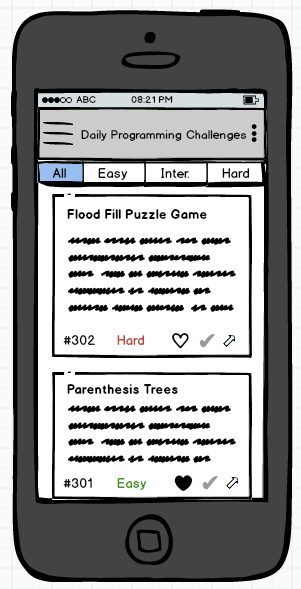
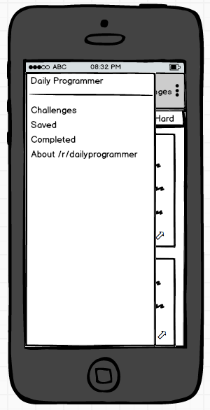
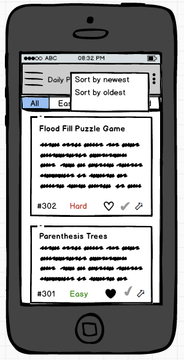
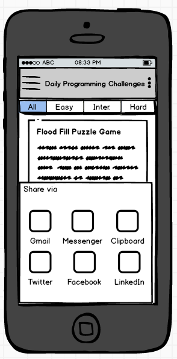
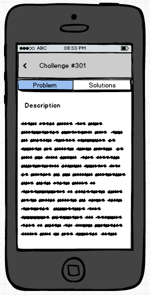
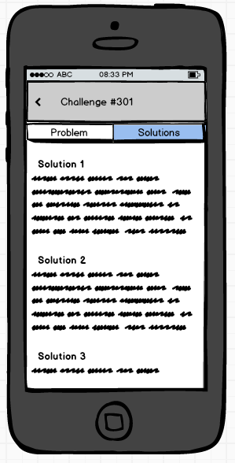
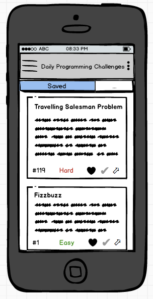
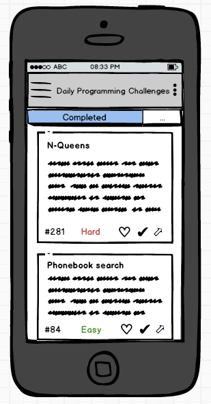
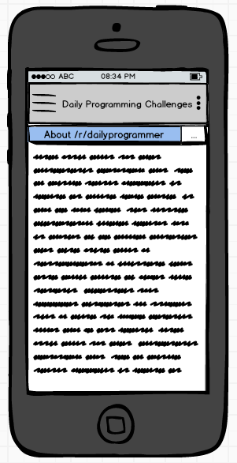
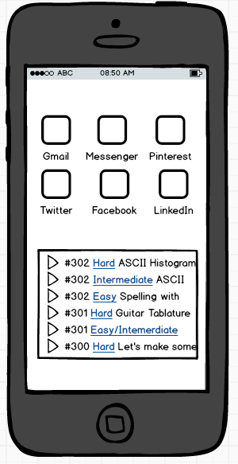

# *Daily Programmer Challenges*

**Daily Programmer Challenges** is an Android app that allows to browse the [/r/dailyprogrammer](https://www.reddit.com/r/dailyprogrammer) subreddit.

## User Stories

The following **required** functionality is completed:

* [ ] 
* [ ] 
* [ ] 

The following **optional** features are implemented:

* [ ]
* [ ]
* [ ]

## Video Walkthrough 

Here's a walkthrough of implemented user stories:

chrom
## Notes

* 
* 
* 
* 

## Mockups

## License

    Copyright [2017] [Erik Cox]

    Licensed under the Apache License, Version 2.0 (the "License");
    you may not use this file except in compliance with the License.
    You may obtain a copy of the License at

        http://www.apache.org/licenses/LICENSE-2.0

    Unless required by applicable law or agreed to in writing, software
    distributed under the License is distributed on an "AS IS" BASIS,
    WITHOUT WARRANTIES OR CONDITIONS OF ANY KIND, either express or implied.
    See the License for the specific language governing permissions and
    limitations under the License.
